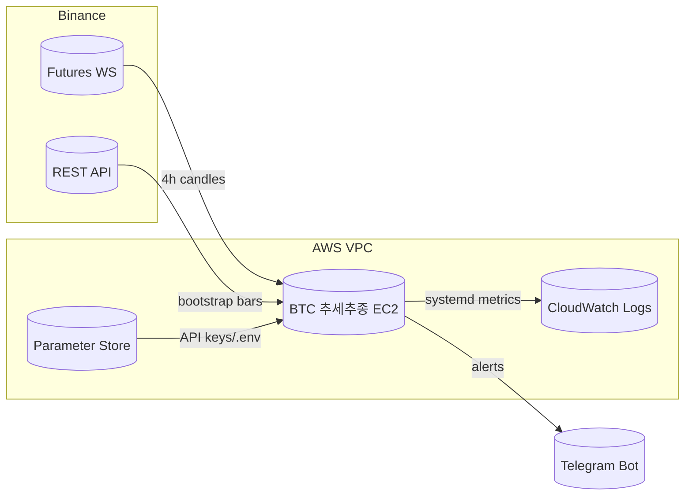

# BTC 추세추종 Cloud Architecture

## Components

- **Binance Futures (Data/Execution)**  
  REST bootstrap delivers historical candles; WebSocket feeds live klines for real-time triggers. Orders are routed via REST (future enhancement).

- **BTC 추세추종 EC2 Instance**  
  Ubuntu 22.04 t3.small inside a private subnet. Python virtualenv hosts `btc_trend_follow.py` run by `systemd` + `tmux` fallback. Uses `/opt/btc_trend_follow` deployment layout with Git pull + ZIP artifact.

- **State and Secrets**  
  `.env` lives in AWS Systems Manager Parameter Store (SecureString). During boot, a `userdata` script fetches secrets (`aws ssm get-parameter --with-decryption`). Equity tracking persists in SQLite (future) or CloudWatch metrics.

- **Observability**  
  `logs/btc_trend_follow.log` tails into CloudWatch Logs via the unified CloudWatch Agent. Critical events also forward to Telegram (token already in `.env`), giving mobile notifications.

- **Network & Security**  
  Security Group exposes only SSH (restricted IP) and outbound 443 for Binance. IAM role grants SSM + CloudWatch permissions; no static keys on disk.

## Deployment Flow

1. Push latest code to Git main.  
2. GitHub Action (future) uploads `BTCTrendFollower_package.zip` to S3.  
3. EC2 pulls package via `aws s3 cp` and unzips into `/opt/btc_trend_follow`.  
4. `systemctl restart BTCTrendFollower` picks up new code with zero-downtime (tmux session kept for manual monitoring).

## Portfolio Highlights

- Demonstrates understanding of AWS primitives (EC2, IAM, SSM, CloudWatch) even as a non-CS background engineer.  
- Shows separation of concerns (indicators, risk, exchange, utils) and production readiness (systemd, runbook, monitoring).  
- Provides a narrative-ready diagram for presentations/interviews.
