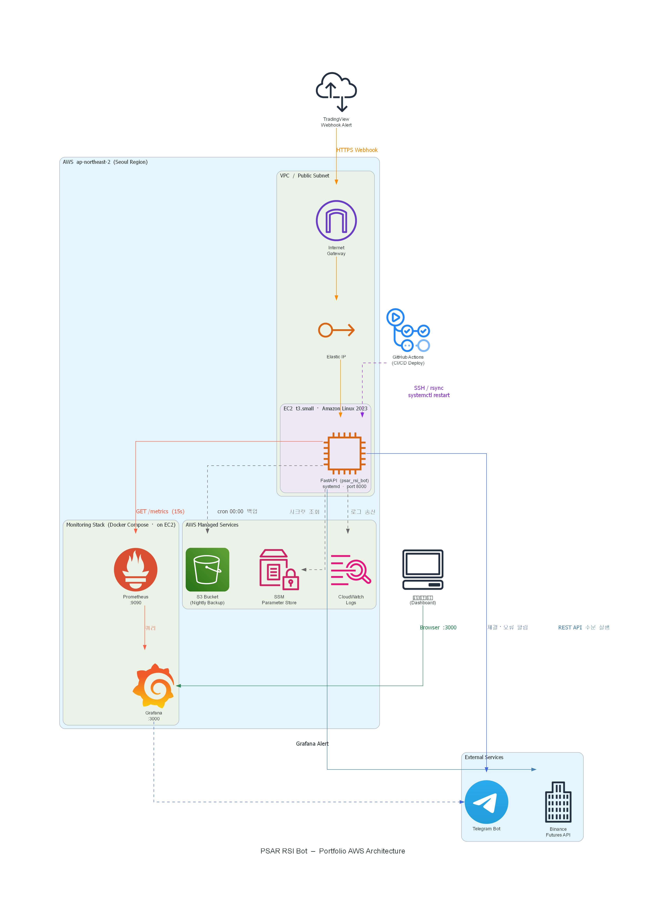
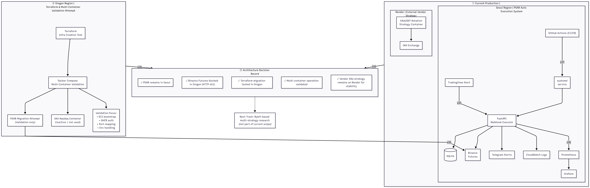
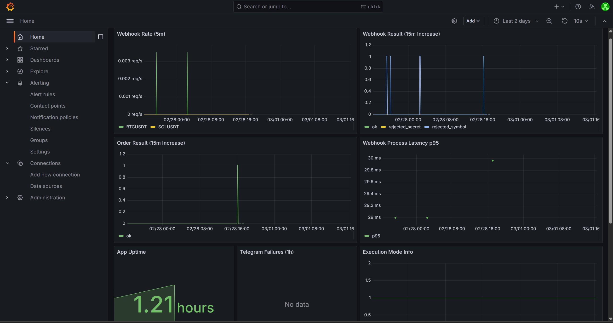
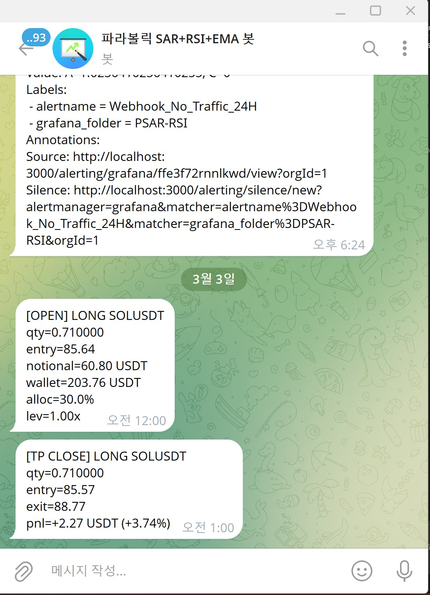
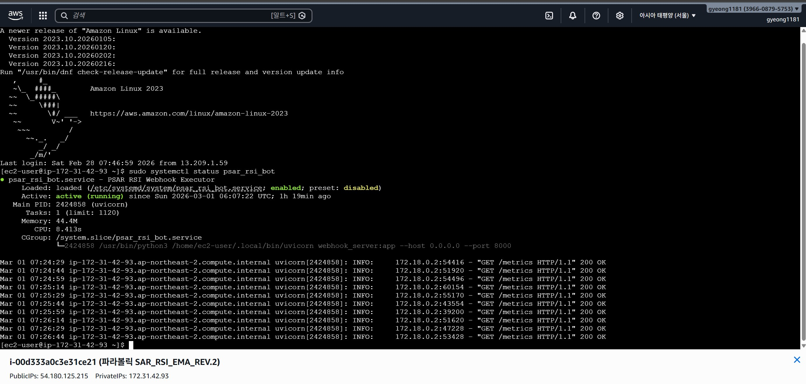
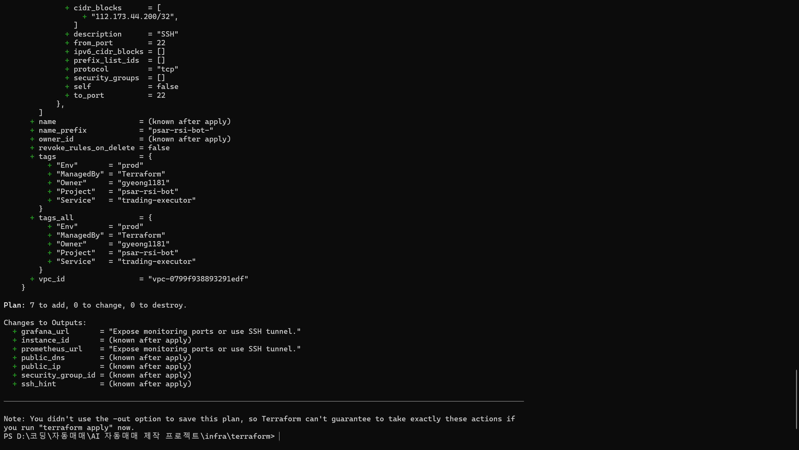

# gyeong1181 | Cloud / DevOps / Infra Portfolio

실제로 운영 가능한 자동화 시스템을 직접 구축하고, 리전 제약과 비용 문제를 검토해 구조를 분리 운영한 프로젝트 저장소입니다.

이 저장소의 핵심은 특정 전략의 수익을 과장하는 것이 아니라, 아래를 실제로 수행했다는 점입니다.

- Webhook 기반 자동 주문 실행기 구축
- AWS EC2 / systemd / Docker Compose 운영
- GitHub Actions 기반 CI/CD
- Prometheus / Grafana / Telegram / CloudWatch 기반 관측
- Terraform으로 신규 리전 인프라 생성
- 거래소/리전 제약을 확인한 뒤 서버 역할 재설계
- 비용 절감을 고려한 멀티 컨테이너 운영 구조 검토

---

## 현재 선택한 운영 구조

이 프로젝트는 현재 두 서버 역할을 명확히 분리하는 방향으로 정리했습니다.

### Seoul Region
- 역할: 포트폴리오용 운영 시스템
- 대상: 내가 만든 PSAR 기반 Webhook Executor
- 목적:
  - Webhook 수신
  - Binance Futures 주문 실행
  - Grafana / Prometheus / CloudWatch / Telegram / CI/CD 증빙
  - 운영 가능한 시스템 구축 경험을 보여주는 포트폴리오 자산

### Oregon Region
- 역할: 외부 전략 전용 멀티 컨테이너 서버
- 대상: 탈개미AI OKX 전략 2종
- 목적:
  - Docker 멀티 컨테이너 운영
  - Terraform 기반 리전 이전 / 인프라 재현
  - 외부 전략 실운용과 서버 분리 경험 축적

### Why This Split
- Oregon에서 Binance Futures 접근 시 `451` 제약을 확인
- 따라서 내가 만든 PSAR 실행기는 Oregon에 두는 것이 맞지 않다고 판단
- 결과적으로 `서울 = 포트폴리오용 PSAR`, `오리건 = OKX 외부 전략`으로 역할을 분리
- 외부 vendor 전략 컨테이너 역시 Render 외 환경에서 멀티 컨테이너로 운영을 시도했으나, 장기 운영 여부는 원 제작자 환경과의 적합성까지 고려해 별도로 재검토했습니다.

이 결정은 기능 추가보다 **운영 적합성**을 우선한 판단입니다.

---

## 포트폴리오 관점에서 무엇을 증명하는가

이 저장소는 "이 전략으로 큰 수익을 냈다"를 보여주기 위한 프로젝트가 아닙니다.  
대신 다음을 증명합니다.

- 운영 가능한 서비스를 직접 만들고 올릴 수 있음
- 문제를 코드, 인프라, 네트워크, 런타임 계층으로 나눠 진단할 수 있음
- 리전 제약이나 레지스트리 인증 문제를 실제 로그로 추적할 수 있음
- 필요하면 구조를 과감히 분리하고 목적을 재정의할 수 있음
- 문서화와 체크리스트로 운영 지식을 남길 수 있음

---

## 핵심 프로젝트

### 1. Portfolio PSAR Executor
TradingView Webhook 신호를 받아 FastAPI 서버에서 검증하고, Binance Futures 주문을 실행하는 자동 주문 실행기입니다.

- 구성: `FastAPI`, `SQLite`, `systemd`, `GitHub Actions`, `CloudWatch`, `Telegram`, `Prometheus`, `Grafana`
- 역할: 포트폴리오용 운영 증명 시스템
- 상태: Seoul 서버에서 운영 가능한 구조로 유지
- 상세 문서: [psar_rsi_bot/README.md](psar_rsi_bot/README.md)

핵심 구현:
- Webhook secret 검증
- `signal_id` 기반 중복 방지
- 허용 심볼/타임프레임 검증
- Binance 필터 검증 및 주문 스킵 처리
- Telegram 체결/오류 알림
- `/metrics` 기반 Prometheus 수집

### 2. Oregon Multi-Container Stack
Terraform으로 생성한 Oregon EC2에서 외부 vendor 전략 컨테이너를 멀티 컨테이너 형태로 운영하는 구조입니다.

- 구성: `Terraform`, `Docker Compose`, `AWS SSM Parameter Store`, `GHCR`, `Docker Hub`
- 대상 컨테이너:
  - `OKX Nasdaq`
  - `OKX Gold`
- 의미:
  - 리전 이전 경험
  - 인프라 재현 경험
  - 멀티 컨테이너 운영 경험
  - 비용 절감 관점의 서버 통합 검토 경험
  - 외부 전략 컨테이너를 Render 외 환경으로 이전 시도하며, 실제 운영 적합성을 검토한 경험

정리:
- "완전 이전 성공"을 과장하지 않음
- 대신 Terraform 기반 이전, 멀티 컨테이너 구동, 런타임 병목 추적, 제약 확인, 구조 재조정까지 실제로 수행한 경험으로 설명

---

## 운영 증빙

### AWS Architecture Diagram (diagram-as-code)
> 실제 운영 중인 시스템 구조를 AWS 공식 아이콘 기반으로 자동 생성한 다이어그램입니다.  
> 생성 스크립트: [`psar_rsi_bot/docs/Architecture/generate_aws_diagram.py`](psar_rsi_bot/docs/Architecture/generate_aws_diagram.py)

### Final Portfolio Architecture

### CloudWatch Logs Insights

### Grafana Alert Rules

### Grafana Live Dashboard

### Telegram Execution Alert

### GitHub Actions CI / Deploy

### Runtime / systemd Health

### Terraform Plan / Apply Validation

---

## 비용 관리 관점

과거에는 Render에서 전략 컨테이너를 분산 운영했고, 컨테이너 3개 기준 월 약 21,000원 수준의 서버 비용이 발생했습니다.

이후 아래 방향으로 재설계를 시도했습니다.

- 전략별 분산 서버 운영을 재검토
- 외부 전략 2종을 AWS 단일 인스턴스 멀티 컨테이너 구조로 통합
- 비용 절감과 운영 복잡도 감소를 동시에 노림

이 과정에서 "무조건 한 서버에 다 올린다"가 아니라, 거래소/리전 제약까지 확인한 뒤 최종적으로 서버 역할을 분리했습니다.

즉, 비용 절감 시도 자체도 했고, 그 한계도 확인한 뒤 구조를 다시 조정했습니다.

---

## 문제 해결 경험

- TradingView 전략 복제 오차로 `0체결` 문제가 발생해 Webhook Executor 구조로 분리
- TradingView payload 해석 문제를 `order_action + position_size` 기준으로 정리
- Binance 최소 주문/필터 오류를 수량 정규화와 사전 검증으로 차단
- 보안그룹, 포트 매핑, Webhook 경로 문제를 분리해 네트워크/앱 계층 구분
- `prometheus_client`, systemd, 경로/권한 이슈를 정리해 상시 구동 구조 안정화
- Terraform `apply` 후 cloud-init, SSM sync, GHCR private pull, Docker Compose startup 병목을 실제로 추적
- Oregon 리전에서 Binance Futures `451` 제약을 확인하고, PSAR를 포트폴리오 시스템으로 서울에 유지하는 방향으로 구조 재조정
- 외부 vendor Docker 2종을 Oregon으로 이전해 멀티 컨테이너 운용까지 시도했지만, 해당 컨테이너가 Render 중심 운영 흐름에 더 최적화되어 있어 장기 유지보다는 구조 검증 경험으로 정리

---

## 시도와 판단

이 프로젝트에서는 실제로 아래를 수행했습니다.

- 서울 리전에서 운영 중이던 시스템을 Terraform 기반으로 Oregon 리전에 옮기는 시도
- Oregon에서 `PSAR + OKX Nasdaq + OKX Gold` 멀티 컨테이너 운용 검증
- 외부 vendor 컨테이너를 Render 외 환경에서 운영 가능한지 확인
- Binance Futures의 Oregon 리전 제약(`451`) 확인
- 검증 결과를 바탕으로 서울 리전 유지, 오리건 역할 축소라는 결론 도출
- 외부 vendor Docker 2종도 Render 외 환경에서 운용을 시도했으나, 원 제작자 운영 흐름과의 적합성을 검토한 뒤 무리한 완전 이전 대신 구조 검증 경험으로 정리

최종적으로 완전 이전을 하지 않았더라도, 인프라 이전과 멀티 컨테이너 운영을 직접 시도하고 제약을 확인한 경험 자체는 충분히 어필 가능한 운영 경험입니다.

---

## 기술 스택

### Cloud / Infra
- AWS EC2
- IAM
- CloudWatch Logs
- systemd
- Docker / Docker Compose
- Terraform
- AWS SSM Parameter Store

### Backend / Runtime
- Python
- FastAPI
- SQLite

### CI/CD / Registry
- GitHub Actions
- SSH / `rsync`
- GitHub Container Registry

### Observability
- Prometheus
- Grafana
- Telegram Alerts

### Integrations
- TradingView Webhook
- Binance Futures API
- OKX-based vendor strategy containers

---

## 문서 맵

- 이 문서: 저장소 전체 포트폴리오 개요
- [psar_rsi_bot/README.md](psar_rsi_bot/README.md): PSAR 실행기 기술 문서
- [server_role_split.md](psar_rsi_bot/docs/Architecture/server_role_split.md): 서울/오리건 서버 분리 아키텍처
- [portfolio_architecture_final.png](psar_rsi_bot/docs/Architecture/portfolio_architecture_final.png): 최종 포트폴리오 아키텍처 도면
- [portfolio_architecture_mermaid_draft.md](psar_rsi_bot/docs/Architecture/portfolio_architecture_mermaid_draft.md): 포트폴리오용 Mermaid 아키텍처 초안
- [2026-03-17_region_role_split.md](psar_rsi_bot/docs/decision_log/2026-03-17_region_role_split.md): 기술적 의사결정 로그
- [seoul_portfolio_recovery_checklist.md](psar_rsi_bot/docs/seoul_portfolio_recovery_checklist.md): 서울 포트폴리오 서버 재가동 체크리스트
- [job_targets/README.md](psar_rsi_bot/docs/job_targets/README.md): 취업용 설명 포인트
- [infra/terraform/README.md](infra/terraform/README.md): Terraform 사용 가이드

---

## 향후 계획

현재 PSAR 기반 시스템은 **포트폴리오용 운영 증명 자산**으로 유지합니다.  
향후 실전 수익 전략은 별도 프로젝트에서 MT5 기반 멀티 전략 구조로 새롭게 분리해 진행할 예정입니다.

즉, 다음 단계는 이 저장소를 무리하게 키우는 것이 아니라:

- 현재 프로젝트: 운영/배포/관측/분리 경험 자산으로 유지
- 향후 MT5 프로젝트: 별도 리포지토리/별도 인프라 트랙으로 분리

이 방향이 가장 관리 가능하고, 포트폴리오 설명도 명확합니다.

현재 이 프로젝트는 포트폴리오와 취업용 프로젝트 기준으로는 마감 가능한 수준까지 정리되었고, 이후에는 운영 모니터링과 최소한의 유지보수 위주로 관리할 예정입니다.

---

## Contact

- Email: `gyeong1181@gmail.com`

---

## Nightly Backup

운영 자동화의 일부로 서울 서버 기준 `소스 코드 + 매매 로그`를 매일 밤 12시에 S3로 백업하는 스크립트와 crontab 예시를 추가했습니다.

- Script: `psar_rsi_bot/scripts/nightly_s3_backup.sh`
- Crontab: `psar_rsi_bot/scripts/nightly_s3_backup.crontab.example`
- Guide: [psar_rsi_bot/docs/nightly_s3_backup.md](psar_rsi_bot/docs/nightly_s3_backup.md)

이 백업은 `.env`, `terraform.tfvars`, SSM 로컬 파일 같은 민감 정보를 기본적으로 제외하고, 코드와 로그만 별도 보관하도록 설계했습니다.

---

## 📦 서버 비용 최적화 기록 (2026-06-15)

**조치 사항**: 자동매매 EC2 서버 비용 최적화를 위해 아래 조치를 실행하였음.

| 항목 | 내용 |
|---|---|
| 기존 상태 | EC2 중지(Stop) 상태 → 월 1.7만원 청구 중 |
| 원인 | EBS 스토리지 + Elastic IP 미사용 과금 |
| 조치 | AMI 백업(system-trading-backup-20260615) → EC2 완전 종료(Terminate) → Elastic IP 릴리스 |
| 결과 | 월 1~2천원 수준으로 감소 |

**재운용 시**: AMI에서 새 인스턴스 시작 → 기존 환경 그대로 복원 가능

**장기 계획**: Lambda + API Gateway 전환, SQLite → DynamoDB, Prometheus → CloudWatch 교체 (취업 후 리팩터링 예정)
