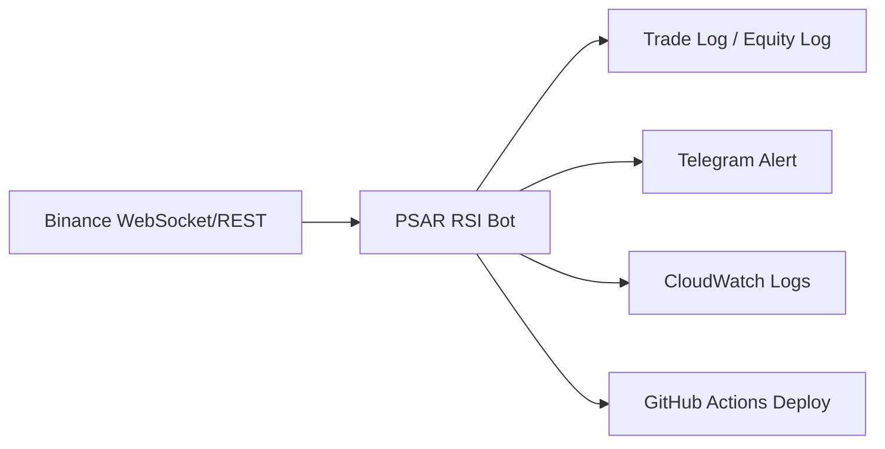

# PSAR RSI 자동매매 봇 (운영형)

트레이딩뷰 기반 PSAR + EMA200 + RSI(50) 전략을 파이썬으로 구현하고, AWS EC2에서 24시간 운영 중인 시스템 트레이딩 봇입니다.  
**운영 로그/알림/배포 자동화**를 통해 “개발만 하는 봇”이 아니라 **운영되는 서비스**로 관리하는 것을 목표로 합니다.

## 핵심 요약
- **전략**: PSAR 전환 + EMA200 방향 + RSI 50 필터
- **실행**: Binance Futures REST/WS, 페이퍼/실거래 전환 가능
- **운영**: EC2 systemd 상시 구동 + GitHub Actions 자동 배포
- **관측/증빙**: CloudWatch Logs Insights, 알림(텔레그램), 배포 로그(GitHub Actions)
- **청산 방식**: Stop-Market + PSAR 신호 청산 (TP 비활성)

---

## 운영 증빙 (Operations Evidence)
운영 중 발생한 이슈를 로그/알림으로 추적하고, 배포 내역을 CI/CD로 관리합니다.

### CloudWatch Logs Insights


### GitHub Actions 배포 로그


### Telegram 알림


> 텔레그램 알림은 거래/에러 상황을 즉시 전달하도록 구성되어 있으며, 운영 중 장애 대응 기록에 활용합니다.

### 운영 증거 수집 방법 (요약)
- systemd 상태 확인:
  - `sudo systemctl status psar_rsi_bot --no-pager`
- GitHub Actions green build 확인:
  - Actions 탭에서 최근 배포 워크플로우 성공 로그 캡처
- CloudWatch 로그 유입 확인:
  - Insights/Live Tail에서 최근 1~3시간 로그 필터링

CloudWatch Logs Insights를 활용해
실행/에러/경고 로그를 시간 범위 기준으로 필터링하며,
실제 운영 중 발생한 Binance API 400 오류 및 스트림 오류를 추적했습니다.

장애 발생 시 로그 기반으로 원인을 좁히고,
알림(텔레그램)과 연계해 빠르게 인지할 수 있도록 구성했습니다.
현재 시스템이 아직 완전하지 않아, **최선의 쿼리 캡처와 텔레그램 알림 캡처**를 정리해 두었습니다.

---

## 아키텍처
### Mermaid (유지)


### Eraser 아키텍처 이미지


### 보조 다이어그램 (Mermaid 이미지)


---

## 동작 흐름 (실무 관점)
1. **REST 워밍업**으로 최근 캔들 수집  
2. **WebSocket 실시간 캔들 수신**  
3. **PSAR/RSI/EMA 계산 → 신호 판단**  
4. **진입/청산 로그 기록 + 알림**  
5. **CloudWatch/GitHub Actions로 운영 증빙**

---

## 실행 방법
### 페이퍼 모드 (단일 심볼)
```bash
cd psar_rsi_bot
python psar_rsi_strategy.py --live --paper --symbol BTCUSDT --interval 1h
```

### 페이퍼 모드 (멀티 심볼)
```bash
cd psar_rsi_bot
python psar_rsi_strategy.py --live --paper --symbols BTCUSDT,SOLUSDT --interval 1h
```

### 실거래 모드 (단일 심볼)
`.env`에 `BINANCE_API_KEY`, `BINANCE_API_SECRET` 입력 후:
```bash
cd psar_rsi_bot
python psar_rsi_strategy.py --live --real --symbol BTCUSDT --interval 1h
```

### 실거래 모드 (멀티 심볼)
```bash
cd psar_rsi_bot
python psar_rsi_strategy.py --live --real --symbols BTCUSDT,SOLUSDT --interval 1h
```

---

## 환경변수 설정
1) `.env.example`을 복사해 `.env` 생성
```bash
copy .env.example .env   # Windows
cp .env.example .env     # Linux/Mac
```
2) 실거래 키 입력
- `BINANCE_API_KEY`, `BINANCE_API_SECRET`
3) 선택 설정
- Telegram 알림: `TELEGRAM_BOT_TOKEN`, `TELEGRAM_CHAT_ID`
- 전략 파라미터: `PSAR_RSI_SYMBOL`, `PSAR_RSI_INTERVAL`, `PSAR_RSI_RISK_PCT`, `PSAR_RSI_RR`,
  `PSAR_RSI_SWING_LOOKBACK`, `PSAR_RSI_LEVERAGE`, `PSAR_RSI_PAPER_MODE`, `PSAR_RSI_EXIT_ON_FLIP`
- 리스크/운영: `PSAR_RSI_MAX_NOTIONALS`(예: `BTCUSDT:120,SOLUSDT:60`),
  `PSAR_RSI_RESERVE`, `PSAR_RSI_MARGIN_BUFFER`, `PSAR_RSI_ALERT_COOLDOWN_SEC`
4) 보안 주의
- `.env`는 절대 GitHub에 올리지 마세요.

---

## Docker 실행 (선택)
> systemd와 Docker를 동시에 사용하면 **중복 실행**될 수 있습니다. 한 가지만 사용하세요.

```bash
cd psar_rsi_bot
docker compose up -d --build
docker compose logs -f
```

---

## 배포 및 운영
- **GitHub Actions** → EC2 `/opt/psar_rsi_bot`로 rsync 배포  
- **systemd**로 상시 실행  

```bash
sudo systemctl daemon-reload
sudo systemctl restart psar_rsi_bot
sudo systemctl status psar_rsi_bot --no-pager
```

---

## 문제 해결 경험 (운영 중심)
- 실시간 거래 0건 → WebSocket 수신 로깅 추가 후 원인 확인  
- 주문 실패(400 Bad Request) → 최소 주문 수량/스텝 사이즈 확인 및 개선  
- 배포 실패/권한 문제 → systemd 경로/권한 정리

## Troubleshooting Highlights
- EC2 배포 경로(`/opt/...`) 권한 문제로 서비스 실행 실패  
  → 소유권/권한 재정의 및 systemd 실행 계정 정리로 해결
- systemd 서비스가 재시작 루프에 빠짐  
  → WorkingDirectory/환경변수 로딩 경로 수정 후 안정화
- GitHub Actions 배포 단계에서 SSH/권한 이슈 발생  
  → 배포 단계 분리 및 키/권한 정책 재정비로 해결
- CloudWatch 로그 수집/조회 범위 혼선  
  → 로그 그룹 분리 및 Insights/Live Tail로 관측 루틴 확립
- 텔레그램 알림 Lambda에서 인코딩 관련 오류 발생  
  → 이벤트 payload 처리 로직 보강으로 해결

---

## 운영 매뉴얼 (Runbook)
### 1) 최초 실행
1. `.env.example`을 복사해 `.env` 생성  
2. `BINANCE_API_KEY`, `BINANCE_API_SECRET` 입력  
3. 실시간 실행
```bash
cd psar_rsi_bot
python psar_rsi_strategy.py --live --real --symbol BTCUSDT --interval 1h
```

### 2) 오류 발생 시 대응
1. systemd 상태 확인
```bash
sudo systemctl status psar_rsi_bot --no-pager
```
2. 로그 확인
```bash
sudo journalctl -u psar_rsi_bot -n 100 --no-pager
```
3. CloudWatch Insights로 최근 오류 필터링  
4. 필요한 경우 재시작
```bash
sudo systemctl daemon-reload
sudo systemctl restart psar_rsi_bot
```

---

## 문서
- 운영/아키텍처: `psar_rsi_bot/docs/Architecture/`
- 직무 타겟 문서: `psar_rsi_bot/docs/job_targets/`
