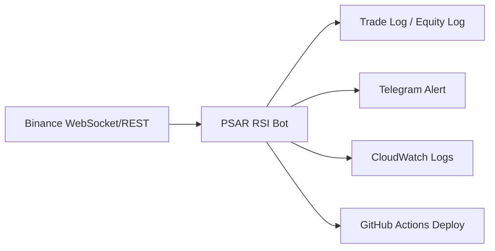

# PSAR RSI 자동매매 봇 (운영형)

트레이딩뷰 기반 PSAR + EMA200 + RSI(50) 전략을 파이썬으로 구현하고, AWS EC2에서 24시간 운영 중인 시스템 트레이딩 봇입니다.  
**운영 로그/알림/배포 자동화**를 통해 “개발만 하는 봇”이 아니라 **운영되는 서비스**로 관리하는 것을 목표로 합니다.

## 핵심 요약
- **전략**: PSAR 전환 + EMA200 방향 + RSI 50 필터
- **실행**: Binance Futures REST/WS, 페이퍼/실거래 전환 가능
- **운영**: EC2 systemd 상시 구동 + GitHub Actions 자동 배포
- **관측/증빙**: CloudWatch Logs Insights, 알림(텔레그램), 배포 로그(GitHub Actions)

---

## 운영 증빙 (Operations Evidence)
운영 중 발생한 이슈를 로그/알림으로 추적하고, 배포 내역을 CI/CD로 관리합니다.

### CloudWatch Logs Insights


### GitHub Actions 배포 로그


> 텔레그램 알림은 거래/에러 상황을 즉시 전달하도록 구성되어 있으며, 운영 중 장애 대응 기록에 활용합니다.

---

## 아키텍처
### Mermaid (유지)


### Eraser 아키텍처 이미지


### 보조 다이어그램 (Mermaid 이미지)


---

## 동작 흐름 (실무 관점)
1. **REST 워밍업**으로 최근 캔들 수집  
2. **WebSocket 실시간 캔들 수신**  
3. **PSAR/RSI/EMA 계산 → 신호 판단**  
4. **진입/청산 로그 기록 + 알림**  
5. **CloudWatch/GitHub Actions로 운영 증빙**

---

## 실행 방법
### 페이퍼 모드
```bash
cd psar_rsi_bot
python psar_rsi_strategy.py --live --paper --symbol BTCUSDT --interval 1h
```

### 실거래 모드
`.env`에 `BINANCE_API_KEY`, `BINANCE_API_SECRET` 입력 후:
```bash
cd psar_rsi_bot
python psar_rsi_strategy.py --live --real --symbol BTCUSDT --interval 1h
```

---

## 배포 및 운영
- **GitHub Actions** → EC2 `/opt/psar_rsi_bot`로 rsync 배포  
- **systemd**로 상시 실행  

```bash
sudo systemctl daemon-reload
sudo systemctl restart psar_rsi_bot
sudo systemctl status psar_rsi_bot --no-pager
```

---

## 문제 해결 경험 (운영 중심)
- 실시간 거래 0건 → WebSocket 수신 로깅 추가 후 원인 확인  
- 주문 실패(400 Bad Request) → 최소 주문 수량/스텝 사이즈 확인 및 개선  
- 배포 실패/권한 문제 → systemd 경로/권한 정리

---

## 문서
- 운영/아키텍처: `docs/Architecture/`
- 직무 타겟 문서: `docs/job_targets/`
