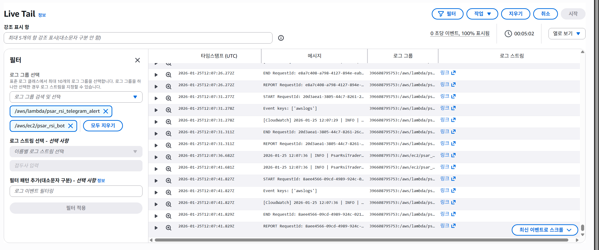
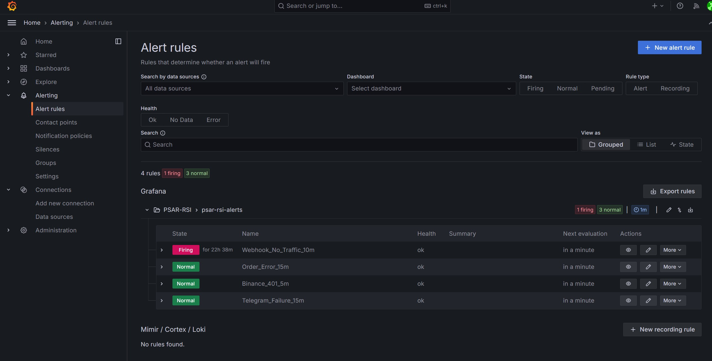
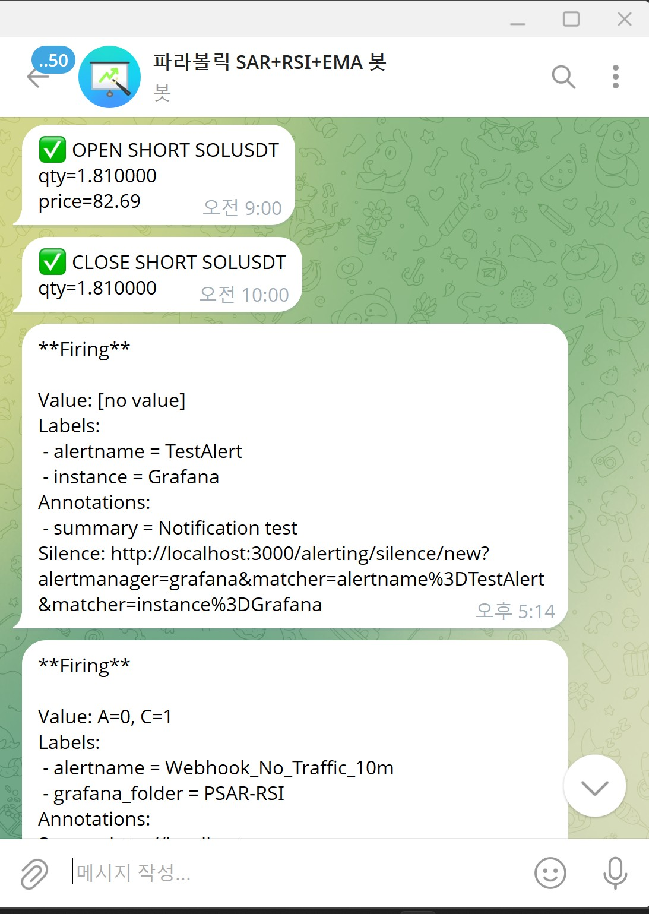
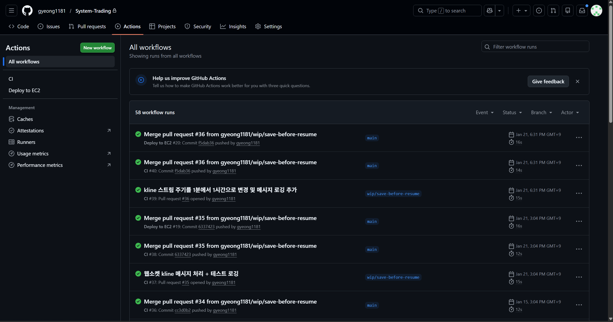

# gyeong1181 | Cloud / DevOps / Infra Portfolio

실제로 운영되는 자동매매 실행기를 만들고, 배포와 모니터링까지 연결해 운영형 포트폴리오로 정리한 저장소입니다.  
핵심은 전략 자체보다, `Webhook 기반 실행기`, `상시 구동`, `알림`, `로그 추적`, `CI/CD`, `운영 문서화`를 끝까지 묶어낸 점입니다.

## 포지셔닝
- 목표 직무: `Cloud Engineer`, `DevOps Engineer`, `Infra Engineer`
- 강점: `실행 가능한 서비스 구축`, `운영 자동화`, `로그/알림 기반 문제 추적`
- 현재 상태: `실거래 운영 중`, `Prometheus/Grafana 연동 완료`, `Terraform IaC 골격 추가 완료`

---

## 핵심 프로젝트
### Automated Trading Executor
TradingView Webhook 신호를 받아 FastAPI 서버에서 검증하고, Binance Futures 주문을 실행하는 자동매매 실행기입니다.

- 실거래 환경: AWS EC2 상시 운영
- 실행 흐름: `TradingView -> FastAPI -> Binance Futures`
- 운영 구성: `systemd`, `GitHub Actions`, `CloudWatch`, `Telegram`, `Prometheus`, `Grafana`
- 상세 문서: [psar_rsi_bot/README.md](psar_rsi_bot/README.md)

주요 구현:
- Webhook secret 검증
- `signal_id` 기반 중복 방지(SQLite)
- 포지션 반전 시 선청산 후 재진입
- 주문 수량 계산, 최소 주문/필터 검증
- 텔레그램 체결/실패 알림
- Prometheus 메트릭 수집 + Grafana 대시보드/알림

---

## 운영 증빙
### CloudWatch Logs Insights

### Grafana Alert Rules

### Telegram Execution Alert

### GitHub Actions CI / Deploy

위 증빙은 단순 코드 작성이 아니라, 실제 운영 중 발생한 이벤트를 로그와 알림으로 추적하고 배포 이력을 남기는 흐름을 보여주기 위한 캡처입니다.

---

## 기술 스택
### Cloud / Infra
- AWS EC2
- IAM
- CloudWatch Logs
- systemd

### Backend / Runtime
- Python
- FastAPI
- SQLite

### CI/CD
- GitHub Actions
- SSH / `rsync` 기반 배포

### IaC
- Terraform

### Observability
- Prometheus
- Grafana
- Telegram Alerts

### External Integrations
- TradingView Webhook
- Binance Futures API

---

## 운영 방식
- 서버 OS: `Amazon Linux 2023 (EC2)`
- 배포 방식: `GitHub Actions -> SSH / rsync -> systemd restart`
- systemd 서비스명: `psar_rsi_bot`
- 실행 모드: `LIVE`
- 현재 실거래 운용: `SOLUSDT 단일 운용`, 잔고 비율 기반 진입
- 확장 방향: 구조상 `BTCUSDT`를 다시 허용해 다중 심볼 운용으로 확장 가능

CloudWatch 로그 그룹명은 저장소 내에 명시돼 있지 않아, 실제 AWS 콘솔 기준 이름으로 추후 확정 반영하는 편이 맞습니다.

---

## 문제 해결 경험
- TradingView 전략 복제 오차로 `0체결` 문제가 발생해, 전략 계산과 주문 실행을 분리한 Webhook Executor 구조로 전환
- Binance 최소 주문/필터 오류가 발생해 수량 정규화 및 스킵/알림 로직 추가
- `401 / 400` API 오류를 로그와 텔레그램 알림으로 추적해 키/권한/엔드포인트 이슈 분리
- systemd 재시작 루프, 경로/권한 문제를 정리해 상시 구동 안정화
- Prometheus / Grafana를 붙여 메트릭, 타깃 상태, 알림 흐름을 운영 기준으로 정리

---

## 문서 전략
- 이 `README.md`: GitHub에서 이 저장소 메인 페이지에 바로 표시되는 문서
- `PROFILE_README_DRAFT.md`: GitHub 프로필 전용 README 초안 (별도 프로필 저장소로 옮겨 쓰는 용도)
- [psar_rsi_bot/README.md](psar_rsi_bot/README.md): 프로젝트 기술 문서
- [infra/terraform/README.md](infra/terraform/README.md): Terraform IaC 가이드 및 골격
- `psar_rsi_bot/docs/`: 아키텍처, 모니터링, 운영 증빙

이 구조를 유지하면, 채용 담당자는 루트에서 빠르게 전체상을 보고, 기술 검토자는 프로젝트 README로 바로 들어가 깊게 확인할 수 있습니다.

---

## 학력 / 배경
- 서울과학기술대학교 공과대학 기계자동차공학과 졸업
- 정규 실무 경력은 없지만, 실제로 동작하는 자동화 시스템을 직접 구축하고 운영하면서 클라우드/DevOps 역량을 포트폴리오로 증명하는 방향으로 정리 중입니다.

---

## Contact
- Email: `gyeong1181@gmail.com`

---

## Next Step
- 기존 수동 생성 리소스를 Terraform으로 정리하거나 `terraform import` 진행
- 운영 Runbook / 장애 대응 문서 보강
- 실거래 운영 데이터 기반으로 README 지표 보강
