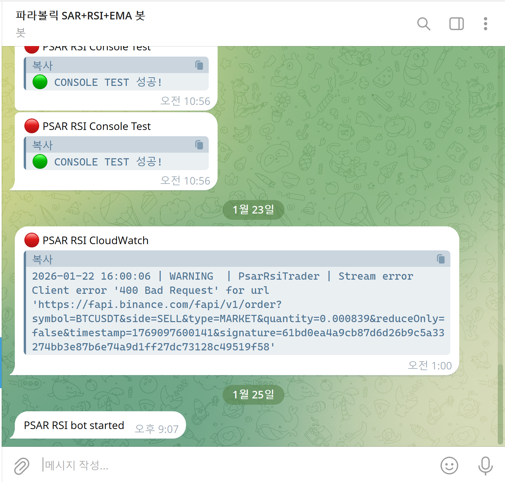
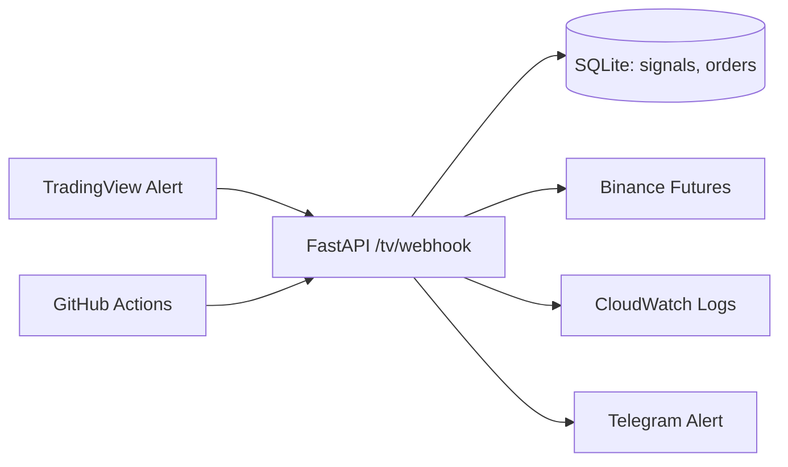

# TradingView Webhook Executor (운영형)

TradingView에서 전략 신호를 계산하고, 서버는 **주문 실행기(Executor)**로만 동작하는 자동매매 시스템입니다.  
AWS EC2에서 24시간 운영하며, GitHub Actions로 자동 배포/재시작합니다.

## 핵심 요약
- **전략 계산**: TradingView Alert
- **실행기**: FastAPI Webhook → Binance Futures
- **운영**: EC2 systemd 상시 구동 + GitHub Actions 자동 배포
- **관측/증빙**: CloudWatch Logs Insights, 텔레그램 알림, 배포 로그

---

## 운영 증빙 (Operations Evidence)
운영 중 발생한 이슈를 로그/알림으로 추적하고, 배포 내역을 CI/CD로 관리합니다.

### CloudWatch Logs Insights


### GitHub Actions 배포 로그


### Telegram 알림


CloudWatch Logs Insights를 활용해
실행/에러/경고 로그를 시간 범위 기준으로 필터링하며,
실제 운영 중 발생한 Binance API 400 오류 및 스트림 오류를 추적했습니다.

장애 발생 시 로그 기반으로 원인을 좁히고,
알림(텔레그램)과 연계해 빠르게 인지할 수 있도록 구성했습니다.
현재 시스템이 아직 완전하지 않아, **최선의 쿼리 캡처와 텔레그램 알림 캡처**를 정리해 두었습니다.

---

## 아키텍처
### Mermaid (유지)


### Eraser 아키텍처 이미지


### 보조 다이어그램 (Mermaid 이미지)


---

## 실행 방법
### 로컬 실행
```bash
cd psar_rsi_bot
uvicorn webhook_server:app --host 0.0.0.0 --port 8000
```

### Docker 실행 (선택)
```bash
cd psar_rsi_bot
docker compose up -d --build
docker compose logs -f
```

---

## 환경변수 설정
1) `.env.example`을 복사해 `.env` 생성
```bash
copy .env.example .env   # Windows
cp .env.example .env     # Linux/Mac
```
2) 필수 입력
- `TV_WEBHOOK_SECRET`
- `EXECUTION_MODE` (RECEIVE_ONLY | DRY_RUN | LIVE)
- `BTC_ORDER_USDT`, `SOL_ORDER_USDT`
- `SL_PCT_BTC`, `SL_PCT_SOL`
- 실거래: `BINANCE_API_KEY`, `BINANCE_API_SECRET`

3) 보안 주의
- `.env`는 절대 GitHub에 올리지 마세요.

---

## 배포 및 운영
- **GitHub Actions** → EC2 `/home/ec2-user/systemTrading/`로 rsync 배포
- **systemd**로 상시 실행
```bash
sudo systemctl daemon-reload
sudo systemctl restart psar_rsi_bot
sudo systemctl status psar_rsi_bot --no-pager
```

---

## 문제 해결 경험 (운영 중심)
- 실시간 거래 0건 → Webhook 기반 executor로 전환
- 주문 실패(400 Bad Request) → 최소 주문/필터 검증 로직 추가
- 배포 실패/권한 문제 → systemd 경로/권한 정리

## Troubleshooting Highlights
- EC2 배포 경로(`/opt/...`) 권한 문제로 서비스 실행 실패  
  → 소유권/권한 재정의 및 systemd 실행 계정 정리로 해결
- systemd 서비스가 재시작 루프에 빠짐  
  → WorkingDirectory/환경변수 로딩 경로 수정 후 안정화
- GitHub Actions 배포 단계에서 SSH/권한 이슈 발생  
  → 배포 단계 분리 및 키/권한 정책 재정비로 해결
- CloudWatch 로그 수집/조회 범위 혼선  
  → 로그 그룹 분리 및 Insights/Live Tail로 관측 루틴 확립
- 텔레그램 알림 Lambda에서 인코딩 관련 오류 발생  
  → 이벤트 payload 처리 로직 보강으로 해결

---

## 문서
- 운영/아키텍처: `psar_rsi_bot/docs/Architecture/`
- 직무 타겟 문서: `psar_rsi_bot/docs/job_targets/`
