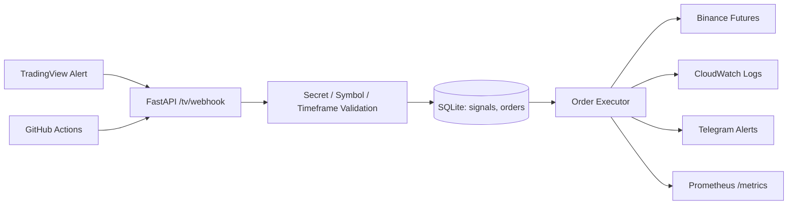

# Automated Trading Executor | Project README

TradingView Webhook 신호를 받아 FastAPI 서버에서 검증하고, Binance Futures 주문을 실행하는 운영형 자동매매 실행기입니다.  
전략 계산은 TradingView가 담당하고, 서버는 `수신 -> 검증 -> 중복 방지 -> 주문 실행 -> 로그/알림`에 집중합니다.

## 현재 운영 상태
- 실행 모드: `LIVE`
- 현재 실거래 운용: `SOLUSDT 단일 운용`
- 현재 진입 방식: `잔고 비율 기반 진입 (EQUITY_PCT)`
- 현재 기본 레버리지: `1x`
- 확장 가능성: 환경변수 변경만으로 `BTCUSDT`를 다시 허용해 다중 심볼 운용 가능
- 인프라 상태: Terraform `plan` 기준 신규 인프라 생성 계획 검증 완료

---

## 핵심 원칙
- 전략 계산은 TradingView에서만 수행
- 서버는 Webhook Executor로만 동작
- `signal_id` 기반 중복 방지
- 포지션 반전 시 선청산 후 재진입 가능
- 주문 실패/스킵/예외를 로그와 텔레그램으로 추적

---

## 시스템 개요


보조 아키텍처 이미지:
- 
- 

---

## 실행 모드
- `RECEIVE_ONLY`: 수신/검증/기록/알림만 수행
- `DRY_RUN`: 주문 수량 계산만 수행
- `LIVE`: 실제 주문 실행

---

## 현재 운용 전략 메모
- TradingView에서 신호 생성
- 서버는 현재 `SOLUSDT`만 허용
- 향후 `TV_ALLOWED_SYMBOLS=BTCUSDT,SOLUSDT`로 되돌리면 BTC 동시 운용 가능
- 구조는 이미 다중 심볼을 고려해 설계되어 있음
- 향후 멀티 계정 구조로 확장하려면 심볼 관리와 별개로 계정/키 분리가 필요함

---

## 주문/리스크 처리
- Webhook secret 검증
- 허용 심볼/타임프레임 검증
- `signal_id` 중복 방지 (SQLite)
- 거래소 필터(`minNotional`, `stepSize`, `tickSize`) 기준 수량 정규화
- 잔고 부족 시 주문 스킵 + 텔레그램 알림
- 반대 포지션 존재 시 선청산 후 신규 진입 (`CLOSE_BEFORE_REVERSE=true`)

현재 기본 리스크 설정 예시:
- `SOL_ORDER_EQUITY_PCT=0.3` : 총 자본의 30% 진입
- `LEVERAGE_DEFAULT=1` : 1배 기준
- `SL_PCT_SOL=0.025` : 2.5% 손절 기준
- `RESERVE_USDT`, `MARGIN_BUFFER` : 여유 증거금 및 안전 버퍼

---

## 텔레그램 알림
주문 성공/실패/스킵/예외를 텔레그램으로 보냅니다.

현재 포맷:
- 오픈: `LONG / SHORT` 구분 포함
- 청산: `TP CLOSE / SL CLOSE / CLOSE` 형태로 표시
- 청산 메시지에는 `entry`, `exit`, `pnl`, `pnl%` 포함

증빙:
- 

---

## 모니터링
### Prometheus
- 엔드포인트: `GET /metrics`
- 주요 메트릭:
  - `webhook_received_total`
  - `webhook_result_total`
  - `webhook_process_seconds`
  - `order_result_total`
  - `order_skip_total`
  - `binance_api_error_total`
  - `telegram_send_total`
  - `telegram_send_fail_total`

### Grafana
- Prometheus 타깃 상태 및 운영 알림 확인
- 경보 룰 / Contact Point / Telegram 알림 테스트 완료
- 라이브 대시보드에서 `Webhook Rate`, `Webhook Result`, `Order Result`, `Latency`, `App Uptime` 패널 정상 갱신 확인

증빙:
- 
- 
- 
- 
- 

---

## TradingView Webhook JSON (현재 사용 형식)
```json
{
  "secret": "YOUR_SECRET",
  "strategy_id": "azzam_psar",
  "symbol": "{{ticker}}",
  "timeframe": "1h",
  "order_action": "{{strategy.order.action}}",
  "position_size": "{{strategy.position_size}}",
  "signal_time": "{{timenow}}",
  "signal_id": "{{timenow}}_{{ticker}}_{{strategy.order.action}}"
}
```

서버는 위 payload를 받아 `order_action`과 `position_size`로 `OPEN/CLOSE`, `LONG/SHORT`를 해석합니다.

---

## 환경 변수 핵심값
필수:
- `TV_WEBHOOK_SECRET`
- `EXECUTION_MODE`
- `BINANCE_API_KEY`, `BINANCE_API_SECRET` (`LIVE`)
- `TELEGRAM_BOT_TOKEN`, `TELEGRAM_CHAT_ID`

현재 실거래 예시:
- `TV_ALLOWED_SYMBOLS=SOLUSDT`
- `TV_ALLOWED_TIMEFRAMES_BY_SYMBOL=SOLUSDT:1h`
- `ORDER_SIZING_MODE=EQUITY_PCT`
- `SOL_ORDER_EQUITY_PCT=0.3`
- `LEVERAGE_DEFAULT=1`
- `SL_PCT_SOL=0.025`

확장 예시:
- `TV_ALLOWED_SYMBOLS=BTCUSDT,SOLUSDT`
- `TV_ALLOWED_TIMEFRAMES_BY_SYMBOL=BTCUSDT:1h,SOLUSDT:1h`

---

## 실행 방법
### 로컬 실행
```bash
cd psar_rsi_bot
uvicorn webhook_server:app --host 0.0.0.0 --port 8000
```

### Docker 실행
```bash
cd psar_rsi_bot
docker compose up -d --build
docker compose logs -f
```

---

## 배포 및 운영
배포 방식:
- GitHub Actions -> SSH / `rsync` -> EC2 `/home/ec2-user/systemTrading/`
- 이후 `psar_rsi_bot` systemd 서비스 재시작

운영 명령:
```bash
sudo systemctl daemon-reload
sudo systemctl restart psar_rsi_bot
sudo systemctl status psar_rsi_bot --no-pager
sudo journalctl -u psar_rsi_bot -n 100 --no-pager
```

운영 상태 검증:
- 현재 운영 서버에서 `psar_rsi_bot.service`가 `active (running)` 상태임을 확인
- `/metrics` 요청이 주기적으로 수집되는 상태를 확인

systemd 유닛 템플릿:
- `deploy/psar_rsi_webhook.service`

---

## 문제 해결 경험
- TradingView 전략 복제 오차로 `0체결` 문제가 발생해 Webhook Executor 구조로 전환
- TradingView Webhook payload와 서버 해석이 어긋나 `action=null` 상태가 발생했고, `order_action + position_size` 기준으로 `OPEN/CLOSE`, `LONG/SHORT`를 해석하도록 정리
- Binance API `400 / 401 / 404` 오류를 키/권한 문제와 엔드포인트 문제로 분리 추적해 일반 주문과 조건부 주문 흐름을 구분
- 최소 주문/필터 미충족으로 인한 실패를 주문 전 검증 로직(`minNotional`, `stepSize`, `tickSize`)으로 차단
- `prometheus_client` 누락과 경로/권한 이슈로 systemd 재시작 루프가 발생했고, 의존성 설치와 서비스 재기동 검증 절차를 정리해 상시 구동 안정화
- 외부 Webhook 미도달 상황은 보안그룹 허용 IP와 서버 리스닝 상태를 함께 확인해 네트워크 문제와 애플리케이션 문제를 분리
- Prometheus / Grafana를 붙여 메트릭 기반 운영 관측 체계 정리
- Terraform `plan`으로 신규 인프라 생성 계획을 코드로 검증

---

## 한계와 다음 단계
현재:
- TradingView 신호 품질과 거래소 상태에 영향을 받음
- 청산 메시지의 손익은 청산 시점 가격 기준 근사치
- Terraform은 `plan` 기준 검증까지 완료했고, 실제 `apply` 또는 기존 리소스 import는 다음 단계

다음 단계:
- `infra/terraform/` 기반으로 인프라 코드화 고도화 또는 기존 리소스 import
- 운영 Runbook / 장애 대응 문서 강화
- 실거래 운영 데이터 기반 지표 정리
- 계정 분리형 멀티 계정 구조 설계

---

## 참고 자료
- 모니터링 스택: `deploy/monitoring/`
- 직무 타겟 문서: `docs/job_targets/`
- 루트 포트폴리오 문서: [../README.md](../README.md)
