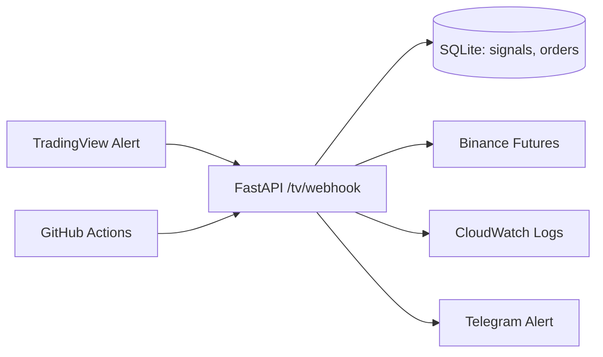

# TradingView Webhook 기반 자동매매 Executor

TradingView에서 전략 신호를 계산하고, 서버는 **주문 실행기(Executor)**로만 동작하도록 전환했습니다.  
기존 전략 복제 실패 문제를 해결하고, 운영/검증/증빙 중심의 포트폴리오로 마감합니다.

## 핵심 원칙
- 전략 계산은 TradingView에서만 수행
- 서버는 Webhook 수신 + 주문 실행 + 기록/알림만 담당
- BTCUSDT, SOLUSDT 1시간봉 / LONG+SHORT 지원

---

## 아키텍처



---

## 실행 모드
- `RECEIVE_ONLY`: 수신/검증/저장/알림만
- `DRY_RUN`: 주문 파라미터 산출만
- `LIVE`: 실제 주문 실행

---

## 포지션 정책
- 동일 심볼 중복 포지션 없음
- 반대 포지션 존재 시: reduceOnly 청산 후 신규 진입
- 진입 시 Stop-Market 손절 강제

---

## 실행 방법 (복붙용)
### 로컬 실행
```bash
cd psar_rsi_bot
uvicorn webhook_server:app --host 0.0.0.0 --port 8000
```

Webhook Endpoint:
- `POST /tv/webhook`
- `GET /health`

예시 URL:
- `http://<server-ip>:8000/tv/webhook`

### Docker 실행
```bash
cd psar_rsi_bot
docker compose up -d --build
docker compose logs -f
```

---

## TradingView Webhook JSON 템플릿
### OPEN LONG
```json
{
  "secret": "YOUR_SECRET",
  "strategy_id": "azzam_psar",
  "symbol": "{{ticker}}",
  "timeframe": "1h",
  "action": "OPEN",
  "side": "LONG",
  "signal_time": "{{timenow}}",
  "signal_id": "{{timenow}}_{{ticker}}_OPEN_LONG"
}
```

### CLOSE LONG
```json
{
  "secret": "YOUR_SECRET",
  "strategy_id": "azzam_psar",
  "symbol": "{{ticker}}",
  "timeframe": "1h",
  "action": "CLOSE",
  "side": "LONG",
  "signal_time": "{{timenow}}",
  "signal_id": "{{timenow}}_{{ticker}}_CLOSE_LONG"
}
```

### OPEN SHORT / CLOSE SHORT
`side`만 `SHORT`으로 변경해 동일 형식 사용

---

## 환경 변수 (.env)
필수:
- `TV_WEBHOOK_SECRET`
- `EXECUTION_MODE` (RECEIVE_ONLY | DRY_RUN | LIVE)
- `BINANCE_API_KEY`, `BINANCE_API_SECRET` (LIVE)
- `BTC_ORDER_USDT`, `SOL_ORDER_USDT`
- `SL_PCT_BTC`, `SL_PCT_SOL`

선택:
- `TV_ALLOWED_SYMBOLS`, `TV_ALLOWED_TIMEFRAMES`
- `LEVERAGE_DEFAULT`, `RESERVE_USDT`, `MARGIN_BUFFER`
- `TELEGRAM_BOT_TOKEN`, `TELEGRAM_CHAT_ID`

---

## DB 구조
- `data/bot.db`
- `signals`: 수신 신호 기록 + 중복 방지
- `orders`: 주문 요청/응답 기록

---

## 검증 플로우
1. RECEIVE_ONLY로 테스트 알림 3회 수신
2. DRY_RUN으로 주문 파라미터 검증
3. LIVE로 최소 주문 1회 성공 (증거 캡처)

---

## 운영/배포 (systemd)
```bash
sudo systemctl daemon-reload
sudo systemctl restart psar_rsi_bot
sudo systemctl status psar_rsi_bot --no-pager
```

systemd 유닛 템플릿: `deploy/psar_rsi_webhook.service`

---

## 참고
- 기존 `psar_rsi_strategy.py`는 **검증/참고용**으로 유지
