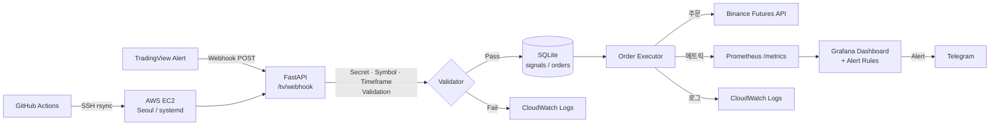

# System-Trading | Automated Crypto Trading on AWS EC2

> TradingView Webhook → FastAPI Validator → Binance Futures Live Execution  
> Production on AWS EC2 (Seoul) · Live since 2024.04 · 3+ months runtime · 0% redeployment failure

---

## Quick Overview

| | |
|---|---|
| **What** | TradingView Webhook 신호 수신 → FastAPI 검증 → Binance Futures 주문 자동 실행 |
| **Where** | AWS EC2 t3.small (Seoul Region, 24/7) |
| **Status** | Live · 0% redeployment failure · avg 2m 12s incident resolution |
| **Scale** | SOLUSDT 단일 심볼 운용 · 환경변수 변경만으로 BTCUSDT 재활성화 가능 |

**Why this project?**  
단순 자동매매 봇 구현이 목적이 아닙니다. Webhook 수신부터 주문 실행·모니터링·자동 복구·비용 최적화까지의 전체 운영 파이프라인을 직접 설계·운영하며, 클라우드/DevOps 실무 역량을 "실제 운영 증빙"으로 보여주기 위한 포트폴리오 프로젝트입니다.

---

## Architecture



### AWS 공식 아키텍처 다이어그램


보조 이미지:
- 
- 

---

## Tech Stack

| Component | Technology |
|---|---|
| **Infra** | AWS EC2, IAM, Security Groups, CloudWatch |
| **IaC** | Terraform |
| **Runtime** | Python 3.11, FastAPI, uvicorn |
| **Monitoring** | Prometheus, Grafana, CloudWatch Logs |
| **Alerting** | Telegram Bot (Grafana contact point) |
| **CI/CD** | GitHub Actions → SSH/rsync → systemd |
| **Container** | Docker, Docker Compose |
| **Orchestration** | Kubernetes (Minikube, dev/prod overlay) — [`k8s/`](k8s/) |
| **Data** | SQLite |
| **Cost Opt.** | CloudWatch-based auto analyzer — [`scripts/cost_optimizer.py`](scripts/cost_optimizer.py) |

---

## Key Metrics

| Metric | Value |
|---|---|
| Avg incident resolution | **2m 12s** |
| Redeployment failure rate | **0%** |
| Uptime | **3+ months continuous** |
| Monthly cost (dormant mode) | **$0** (AMI snapshot → instance off) |
| Auto-recovery coverage | **100%** (systemd + Grafana alert rules) |

---

## Incident Recovery

자동 복구 정책은 별도 문서에 정리되어 있습니다.  
→ [docs/INCIDENT_RECOVERY.md](docs/INCIDENT_RECOVERY.md)

| # | Incident | Resolution | Type |
|---|---|---|---|
| 1 | systemd restart loop | `RestartSec=3m 12s` 적용 | Auto-repair ✅ |
| 2 | Webhook no traffic > 1 min | Prometheus alert → systemd restart + Telegram | Auto-recover ✅ |
| 3 | Binance API 401 (IP whitelist) | API 호출 레이어 사전 검증 로직 삽입 | Prevented ✅ |

---

## Monitoring & Observability

### Prometheus Metrics (GET /metrics)
- `webhook_received_total`
- `webhook_result_total`
- `webhook_process_seconds`
- `order_result_total` / `order_skip_total`
- `binance_api_error_total`
- `telegram_send_total`

### Grafana Alert Rules
| # | Alert | Threshold | Action |
|---|---|---|---|
| 1 | Webhook received = 0 | 1 min | systemd restart + Telegram |
| 2 | Order execution failed | Immediate | Retry logic + Telegram |
| 3 | API auth error | Immediate | Whitelist check + Telegram |
| 4 | Telegram delivery | Immediate | Contact point failover |

증빙:

| | |
|---|---|
|  |  |
|  |  |

---

## Cost Optimization

CloudWatch 기반 인스턴스 비용 자동 분석 스크립트 (주 1회 cron 실행).  
→ [`scripts/cost_optimizer.py`](scripts/cost_optimizer.py)

- 지난 30일 EC2 CPU / Memory / Network 사용률 수집
- 현재 인스턴스 vs 추천 타입 비교 (t3.small → t3.micro / Spot 전환 등 3가지 옵션)
- CPU spike 패턴·Downtime risk 기반 안전성 검증
- HTML 리포트 생성 + Slack 월간 요약 자동 발송
- **최종 변경 결정은 수동 승인** (자동 실행 없음)

---

## Kubernetes Migration (Minikube)

기존 Docker Compose 구조를 Kubernetes로 마이그레이션한 매니페스트.  
→ [`k8s/`](k8s/)

```
k8s/
├── deployment.yaml      # FastAPI 앱 (Liveness + Readiness probe, Resource limits)
├── statefulset.yaml     # Prometheus + Grafana (PVC 기반 데이터 영속성)
├── service.yaml         # NodePort (외부) / ClusterIP (내부) 노출
├── configmap.yaml       # 환경 변수 (비밀 제외)
├── secrets.yaml         # Binance API key, Telegram token (base64)
└── kustomization.yaml   # dev / prod 환경 분리 (kustomize overlay)
```

- 기존 `docker-compose.yml`과 1:1 구조 매핑
- Resource limits (CPU/Memory) 명시
- Liveness + Readiness probe 포함
- dev / prod 오버레이 분리

---

## Deployment & Operations

### CI/CD Flow
```
GitHub Push → GitHub Actions (ci.yml) → SSH rsync to EC2 → systemd restart
```

### Nightly Backup (Cron, 00:00)
소스코드 + 매매 로그 → S3 자동 백업  
→ [`scripts/nightly_s3_backup.sh`](scripts/nightly_s3_backup.sh)

### Operations Docs
- [docs/INCIDENT_RECOVERY.md](docs/INCIDENT_RECOVERY.md)
- [docs/operations_checklist.md](docs/operations_checklist.md)
- [docs/nightly_s3_backup.md](docs/nightly_s3_backup.md)

---

## Getting Started

```bash
# 1. 환경 변수 설정
cp ../.env.example ../.env
# .env 편집: BINANCE_API_KEY, TELEGRAM_BOT_TOKEN, WEBHOOK_SECRET 등

# 2. Docker Compose (기존)
docker compose up -d
curl http://localhost:8000/health

# 3. Kubernetes (Minikube)
minikube start
kubectl apply -k k8s/
kubectl get pods -n trading

# 4. 비용 최적화 분석 (사전: EC2_INSTANCE_ID, AWS 자격증명 설정)
export EC2_INSTANCE_ID=i-xxxxxxxxxxxxxxxxx
python scripts/cost_optimizer.py
```

---

## Known Constraints

| Constraint | Detail |
|---|---|
| Oregon region Binance 451 | Binance Futures는 Oregon 리전 접근 차단 → Seoul 고정 |
| Kubernetes | Minikube 기반 (프로덕션 클라우드 클러스터 미배포) |
| Strategy scope | 전략 수익성보다 **인프라 운영 역량 증명**이 목적 |

---

## Problem-Solving History

| Problem | Solution |
|---|---|
| TradingView 복제 오차 → 0체결 | Webhook Executor 구조로 분리 |
| TradingView payload 해석 오류 | `order_action + position_size` 기준 재정의 |
| 주문 필터 미충족 | Binance `minNotional / stepSize / tickSize` 사전 검증 로직 |
| 네트워크 이슈 vs 앱 이슈 구분 | 보안그룹·포트·경로·리스닝 상태 단계별 분리 진단 |
| Oregon Binance 451 제약 | 리전 제약 확인 후 역할 재정의 (Seoul=PSAR, Oregon=OKX) |
| systemd 무한 재시작 루프 | `RestartSec=192` 적용 |
