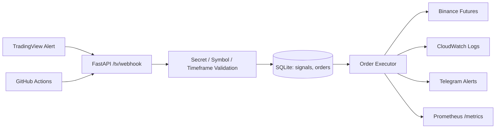
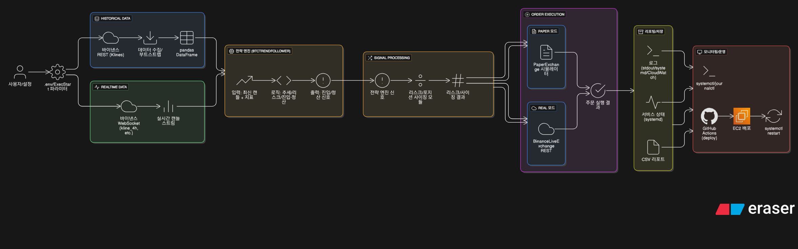
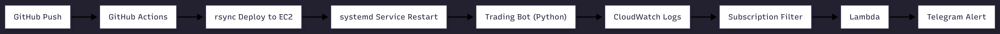
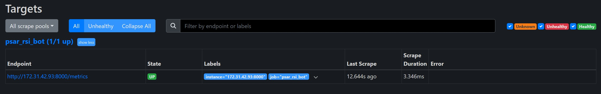

# Portfolio PSAR Executor | Project README

이 프로젝트는 TradingView Webhook을 받아 주문을 실행하는 자동 주문 실행기입니다.  
현재 이 전략 자체를 핵심 수익 전략으로 과장하지 않고, **운영 가능한 자동화 시스템을 구축·배포·관측·분리 운영한 포트폴리오 자산**으로 정리하고 있습니다.

---

## 프로젝트 목적 재정의

현재 이 프로젝트의 목적은 다음과 같습니다.

- Webhook 기반 자동 주문 실행기 구축
- AWS EC2 / systemd / CI/CD 기반 운영 경험 축적
- Grafana / Prometheus / Telegram / CloudWatch 기반 관측 체계 정리
- Terraform을 이용한 신규 리전 인프라 생성 경험 확보
- 리전/거래소 제약을 실제로 확인하고 운영 구조를 재설계한 경험 정리

즉, 이 프로젝트는 "수익률 과시용 전략"보다 **운영형 시스템 구축 경험**을 보여주는 용도에 가깝습니다.

---

## 현재 역할

이 PSAR 시스템은 **서울 리전 포트폴리오 서버**에서 운영하는 것이 기준입니다.

### Seoul Region에서의 역할
- 내가 만든 전략용 서버
- Webhook Executor 운영
- Binance Futures 연동
- Grafana / Prometheus / CloudWatch / Telegram / CI/CD 증빙
- 포트폴리오용 운영 시스템

### Oregon Region과의 관계
- Oregon은 외부 vendor 전략(OKX) 멀티 컨테이너 전용으로 분리
- PSAR는 Oregon에서 Binance Futures 제약(`451`)을 확인했으므로 기본 배치 대상에서 제외
- 멀티 컨테이너 운영 자체는 실제로 시도했으나, 외부 vendor 컨테이너는 Render 중심 운영 흐름에 더 맞는 부분이 있어 장기 운영 대상에서는 제외 가능성을 열어둠

이 프로젝트에서 중요한 점은 "오리건 이전을 못 했다"가 아니라, 실제로 이전과 운영을 시도한 뒤 리전 적합성과 운영 적합성을 근거로 역할을 다시 정했다는 점입니다.

---

## 시스템 개요

보조 이미지:
- 
- 
- 

---

## 핵심 기능

- Webhook secret 검증
- 허용 심볼 / 허용 타임프레임 검증
- `signal_id` 기반 중복 방지
- Binance 필터(`minNotional`, `stepSize`, `tickSize`) 기준 수량 정규화
- 잔고 부족 / 주문 스킵 / 예외를 Telegram과 로그로 기록
- `/metrics` 엔드포인트를 통한 Prometheus 수집
- Grafana 대시보드 / 경보 룰 운영

---

## 현재 운용 기준

- 실행 모드: `LIVE`
- 현재 주 심볼: `SOLUSDT`
- 주문 사이징: `EQUITY_PCT`
- 레버리지: `1x`
- 목적: 전략 수익 극대화보다 운영 시스템 검증

확장성:
- 환경변수 변경만으로 `BTCUSDT` 재허용 가능
- 구조상 다중 심볼로 확장 가능
- 다만 현재는 운영 단순성과 포트폴리오 설명력을 우선해 단일 심볼 기준으로 정리

---

## 모니터링 및 운영 증빙

### Prometheus
- 엔드포인트: `GET /metrics`
- 대표 메트릭:
  - `webhook_received_total`
  - `webhook_result_total`
  - `webhook_process_seconds`
  - `order_result_total`
  - `order_skip_total`
  - `binance_api_error_total`
  - `telegram_send_total`

### Grafana
- Alert rule 구성
- Telegram contact point 테스트
- Webhook / Order / Latency / Uptime 시각화

증빙:
- 
- 
- 
- 
- 

---

## 배포 및 운영 방식

### Seoul Legacy
- `GitHub Actions -> SSH / rsync -> systemd restart`
- 서비스명: `psar_rsi_bot`
- 경로: `/home/ec2-user/systemTrading/psar_rsi_bot`

### Terraform / Docker 실험 경로
- `/opt/trading-stack` 기준 multi-container compose stack 생성 가능
- 단, 이 경로는 현재 PSAR 실전 배치보다 **운영 구조 검증 및 리전 분리 경험** 측면에서 의미가 큼

운영 체크 문서:
- [operations_checklist.md](docs/operations_checklist.md)
- [seoul_portfolio_recovery_checklist.md](docs/seoul_portfolio_recovery_checklist.md)
- [portfolio_architecture_mermaid_draft.md](docs/Architecture/portfolio_architecture_mermaid_draft.md)
- [nightly_s3_backup.md](docs/nightly_s3_backup.md)

---

## Nightly Backup

서울 서버 기준으로 `소스 코드 + 매매 로그`를 매일 밤 12시에 S3로 올리는 자동 백업 스크립트와 crontab 예시를 추가했습니다.

- Script: `psar_rsi_bot/scripts/nightly_s3_backup.sh`
- Crontab: `psar_rsi_bot/scripts/nightly_s3_backup.crontab.example`
- Guide: [nightly_s3_backup.md](docs/nightly_s3_backup.md)

목적은 운영 중인 시스템에 정기 보존 정책을 직접 구성하고 검증한 경험을 남기기 위함입니다.

---

## 거래소 / 리전 제약을 반영한 현재 판단

이 프로젝트에서 중요한 기술적 판단은 다음입니다.

- Oregon 리전에서 Terraform 기반 멀티 컨테이너 구조를 실제로 검증
- 그러나 Binance Futures 접근 시 `451` 제약을 확인
- 따라서 PSAR 시스템은 Oregon의 주 운영 대상이 아니라는 결론 도출
- 결과적으로:
  - `Seoul = PSAR 포트폴리오 운영 시스템`
  - `Oregon = 외부 OKX 전략 멀티 컨테이너`

추가 판단:
- 외부 vendor 전략 2종도 Oregon에서 멀티 컨테이너로 실제 구동을 시도했다
- 다만 운영 과정에서 해당 컨테이너가 Render 환경 기준으로 더 안정적으로 설계된 정황을 확인했습니다.
- 따라서 "이전 자체를 못 했다"가 아니라, "이전과 멀티 컨테이너 운영을 시도했고, 운영 적합성을 검토한 뒤 유지 여부를 다시 판단했다"는 흐름으로 정리하는 것이 맞습니다.

이 판단은 "일단 다 올리고 본다"가 아니라, **실제 제약을 확인한 뒤 워크로드를 분리한 운영 결정**이라는 점에서 의미가 있습니다.

---

## 비용 관점

과거에는 Render에서 전략 컨테이너를 각각 분산 운영하며 월 약 21,000원 수준의 비용이 발생했습니다.

이후:
- 외부 전략 2개를 AWS 단일 인스턴스에 통합하는 방향을 검토
- 멀티 컨테이너 운영으로 고정비 절감 시도
- 동시에 거래소/리전 적합성을 다시 검토

결과적으로:
- 비용 절감 시도는 실제로 수행
- 그러나 Binance 리전 제약까지 고려해 최종 구조는 단순 통합이 아니라 **역할 분리형 구조**로 재조정

비용을 줄이기 위한 기술적 시도도 했고, 그 과정에서 확인된 제약을 반영해 운영 구조를 재조정했다는 점이 이 프로젝트에서 중요한 판단입니다.

---

## 문제 해결 경험

- TradingView 전략 복제 오차로 `0체결` 문제가 발생해 Webhook Executor 구조로 분리
- TradingView payload 해석 문제를 `order_action + position_size` 기준으로 정리
- 주문 필터 미충족 문제를 사전 검증 로직으로 차단
- 보안그룹, 포트 매핑, 경로, 리스닝 상태를 나눠 네트워크 문제와 앱 문제를 분리
- Prometheus / Grafana를 붙여 운영 관측 체계를 정리
- Terraform `apply` 이후 cloud-init, SSM sync, GHCR private image pull, compose startup 병목을 실제로 추적
- Oregon에서 Binance Futures `451`를 확인하고, 시스템 배치 목적을 다시 정의

---

## 한계와 다음 단계

현재 한계:
- 전략 자체의 수익성은 이 프로젝트의 핵심 메시지가 아님
- TradingView 신호 품질과 거래소 상태에 영향을 받음
- Oregon에서는 Binance Futures 제약이 존재함

다음 단계:
- 서울 리전 기준 포트폴리오 운영 시스템 안정화
- 운영 체크리스트와 모니터링 증빙 강화
- 이 프로젝트와 별개로 MT5 기반 멀티 전략 프로젝트를 별도 트랙으로 진행

즉, 이 저장소는 앞으로도 **운영 가능한 자동화 시스템 포트폴리오**로 유지하고, MT5 기반 새 전략은 별도 저장소/별도 서버 구조로 분리하는 것이 맞습니다.

현재 상태 기준으로는 포트폴리오 및 취업용 프로젝트로 마감 가능한 수준까지 정리되었고, 이후에는 운영 모니터링과 소규모 보완 위주로 관리할 계획입니다.
