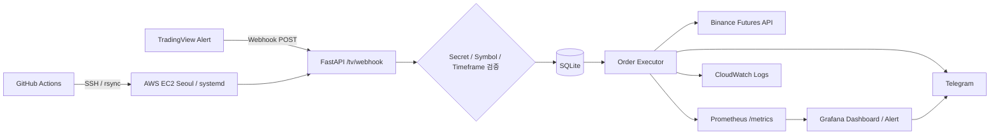
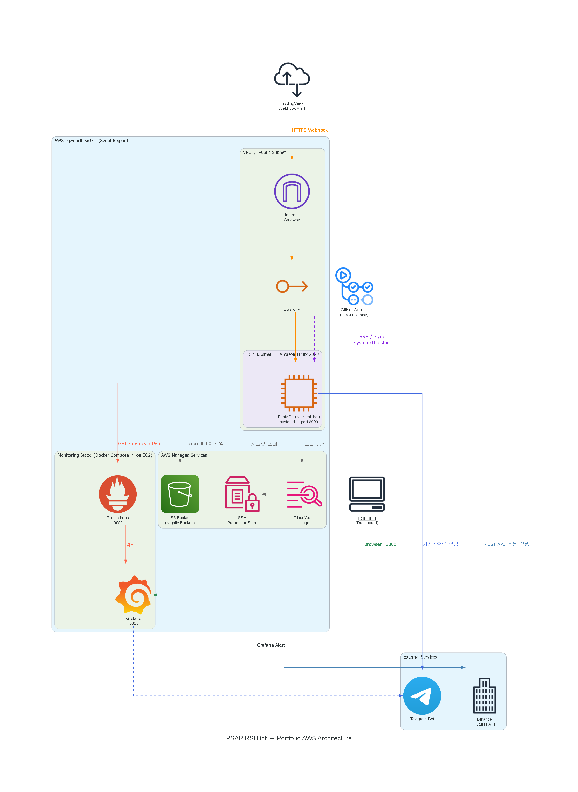

# PSAR Webhook Executor | AWS EC2 운영 프로젝트

> TradingView Webhook → FastAPI 검증 → Binance Futures 주문 실행
> AWS EC2 서울 리전 · systemd 운영 · 최초 배포 2025-12-22

자동매매는 도메인일 뿐, 이 프로젝트의 핵심은 AWS/Linux 운영, 배포 자동화, 관측, 장애 대응과 인프라 실험입니다. 2026-09 기준 전체 프로젝트 경험은 약 9개월이며, 이는 특정 프로세스의 연속 가동 기간을 뜻하지 않습니다.

## Quick Overview

| 항목 | 범위 |
|---|---|
| 서비스 | TradingView 신호를 검증하고 Binance Futures 주문을 실행하는 FastAPI Webhook Executor |
| 서울 환경 | AWS EC2 + systemd 기반 운영 환경 |
| 배포 | GitHub Actions → SSH/rsync → `daemon-reload` / service restart |
| 관측 | Prometheus, Grafana, CloudWatch Logs, Telegram |
| 컨테이너 | 주요 실제 사용은 Oregon 이전 실험의 Docker Compose 스택 |
| Kubernetes | Minikube 로컬 배포 검증; 실제 EKS apply·운영 없음 |

## Architecture

```mermaid
flowchart LR
    TV[TradingView Alert] -->|Webhook POST| API[FastAPI /tv/webhook]
    API --> VALID{Secret / Symbol / Timeframe 검증}
    VALID --> DB[(SQLite)]
    DB --> EXE[Order Executor]
    EXE --> BINANCE[Binance Futures API]
    EXE --> PROM[Prometheus /metrics]
    EXE --> CW[CloudWatch Logs]
    EXE --> TG[Telegram]
    PROM --> GF[Grafana Dashboard / Alert]
    GF --> TG
    GHA[GitHub Actions] -->|SSH / rsync| EC2[AWS EC2 Seoul / systemd]
    EC2 --> API
```

## 운영·트러블슈팅 기록

### 1. 2025-12-22 systemd 최초 기동 장애

한 가지 원인이 아니라 다음 세 가지 설정 오류가 겹쳤습니다.

1. unit file을 `/etc/systemd/system`이 아닌 `/etc/systmed`에 둔 경로 오타
2. `ExecStart`가 존재하지 않는 `bot_main.py`를 참조
3. 실행 옵션이 없어 `run_live()` 대신 `run_paper_test()` 실행 후 종료

조치:

- unit file을 올바른 경로로 이동
- `ExecStart`를 실제 실행 파일인 `psar_rsi_strategy.py`로 수정
- `--live --paper --paper-bars 750` 옵션 추가
- `systemctl daemon-reload`와 restart 후 `Active: active (running)` 확인
- `RestartSec=10` 적용: FastAPI 기동 약 5초 + 여유 5초

### 2. Binance API 401

실제 인증 장애 발생 후 Public IP 변경과 Binance IP whitelist 불일치를 확인해 수정했습니다. 이후 재발 위험을 줄이기 위해 Elastic IP와 startup 사전 검증 로직을 추가했습니다. 처음부터 예방되어 장애가 없었던 사례가 아닙니다.

### 3. Binance 400/minNotional

2026-01-26 단일 장애 사례에서 18:27:51 오류를 확인했고, 필터·주문 수량 처리를 점검한 뒤 18:31:03 정상 주문 재개를 확인했습니다. 소요 시간은 **이 사례에 한해 3분 12초**이며 평균 장애 해결시간이 아닙니다.

### 4. Oregon 이전 실험

- 비용과 운영 구조 개선을 목적으로 Terraform `apply` 수행
- EC2, IAM, Security Group, Elastic IP 생성
- Docker Compose 멀티 컨테이너 기동 시도
- cloud-init 실패, Amazon Linux 2023 패키지 충돌, 서비스 기동, GHCR private image 인증, 작업 PC Public IP 변경에 따른 SSH Security Group 불일치를 단계적으로 분리 진단
- 최종적으로 Binance Futures가 Oregon에서 HTTP 451을 반환함을 확인

HTTP 451은 코드나 네트워크 설정만으로 해결할 수 있는 문제가 아니므로 완전 이전이나 멀티리전 프로덕션 운영으로 표현하지 않습니다. 최종 역할은 `서울=PSAR 운영/포트폴리오`, `Oregon=외부 OKX 전략 실험`으로 분리했습니다.

상세 기록: [docs/INCIDENT_RECOVERY.md](docs/INCIDENT_RECOVERY.md)

## Observability

- `/metrics`에서 Webhook, 주문 결과, Binance API 오류, Telegram 전송 지표 노출
- Prometheus 수집 및 Grafana 대시보드 구성
- Grafana Alert Rule과 Telegram Contact Point 구성
- CloudWatch Logs Insights로 런타임 로그 조회
- systemd의 프로세스 실패 시 자동 재시작 정책과 모니터링 알림을 별도 계층으로 구성

> Grafana 알림이 systemd 재시작을 직접 실행한다고 일반화하지 않습니다. 자동 재시작은 systemd 정책, 이상 감지와 운영자 통지는 Prometheus/Grafana/Telegram의 역할입니다.

## 비용 최적화

- 과거 AWS 비용: 월 4만원대
- 최근 대표 비용: 약 6,000원
- 절감 폭: 약 85%
- 수행 조치: AMI 백업, 불필요 EC2 Terminate, Elastic IP 정리
- 확인한 운영 특성: EC2가 Stop 상태여도 EBS와 EIP 관련 비용이 남을 수 있음

비용 분석 도구: [`scripts/cost_optimizer.py`](scripts/cost_optimizer.py)

## Kubernetes 범위

이 디렉터리의 매니페스트와 별도 `k8s-msa` 프로젝트를 통해 Minikube 로컬 환경에서 다음 항목을 검증했습니다.

- Deployment / StatefulSet / Service / ConfigMap
- Liveness / Readiness Probe와 Resource Limit
- Kustomize dev/prod overlay
- Terraform 기반 VPC/EKS/ECR 구성 작성 및 `terraform plan`

AWS 범위는 Terraform 구성 작성과 `plan` 검증에서 종료했으며 실제 EKS `apply`는 수행하지 않았습니다. 자세한 두 번째 프로젝트는 [../k8s-msa/README.md](../k8s-msa/README.md)를 참고합니다.

## Tech Stack

| 영역 | 기술 |
|---|---|
| Cloud / IaC | AWS EC2, IAM, Security Group, Elastic IP, CloudWatch, Terraform |
| Runtime | Linux, systemd, Python 3.11, FastAPI, uvicorn |
| CI/CD | GitHub Actions, SSH, rsync |
| Observability | Prometheus, Grafana, CloudWatch Logs, Telegram |
| Data | SQLite |
| Experiment | Docker, Docker Compose, Kubernetes(Minikube), Kustomize |

## Evidence & Operations Docs

- [Grafana / Prometheus 구성](deploy/monitoring/README.md)
- [장애 대응 기록](docs/INCIDENT_RECOVERY.md)
- [서울 서버 복구 체크리스트](docs/seoul_portfolio_recovery_checklist.md)
- [운영 체크리스트](docs/operations_checklist.md)
- [Terraform 인프라 실험](../infra/terraform/README.md)

## Known Constraints

| 항목 | 사실 기준 |
|---|---|
| 프로젝트 기간 | 2025-12-22 최초 배포, 2026-09 기준 약 9개월 |
| 연속 가동 | 전체 프로젝트 기간과 별도이며 절대 uptime 수치로 표현하지 않음 |
| 자동 복구 | systemd 재시작 정책 구성; 모든 장애의 자동 복구를 의미하지 않음 |
| Oregon | 이전·멀티 컨테이너 실험 환경, 완전 마이그레이션 아님 |
| Kubernetes | Minikube 배포 검증 |
| EKS | Terraform plan까지만 검증, 실제 구축·운영 없음 |
