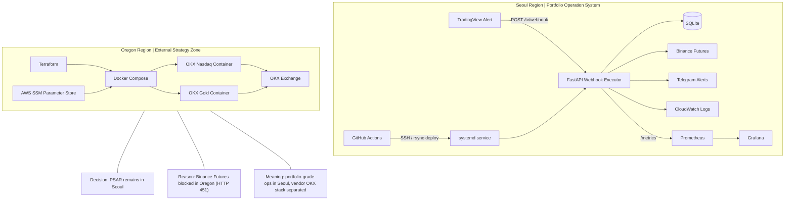
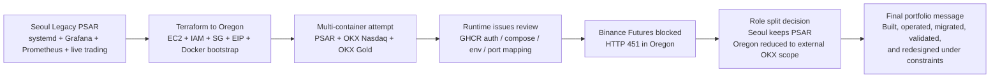

# Portfolio Architecture Mermaid Draft

이 문서는 포트폴리오용 시각화 아키텍처 초안이다.  
메인 다이어그램은 현재 최종 운영 구조를, 보조 다이어그램은 Oregon 이전 시도와 최종 구조 조정을 보여준다.

---

## 1. Current Operating Architecture

---

## 2. Migration Attempt and Final Decision

---

## 3. Caption Draft

- 현재 프로젝트는 수익 자랑용 전략이 아니라, 운영 가능한 자동화 시스템을 직접 구축하고 배포·관측·분리 운영한 포트폴리오 자산이다.
- Terraform 기반 Oregon 이전과 멀티 컨테이너 운용을 실제로 시도했고, Binance 리전 제약과 vendor 환경 적합성을 확인한 뒤 구조를 다시 조정했다.
- 최종적으로 서울은 포트폴리오용 PSAR 운영 시스템, Oregon은 외부 전략 실험/운영 영역으로 역할을 분리했다.
