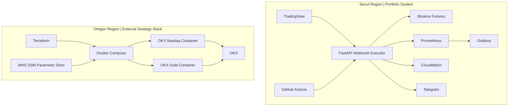

# Server Role Split

현재 이 프로젝트는 서울 리전과 오리건 리전을 서로 다른 목적의 서버로 분리해 운영하는 방향으로 정리했다.

핵심은 "전략을 한 서버에 몰아 넣는다"가 아니라, 거래소 제약과 포트폴리오 목적을 기준으로 서버 역할을 분리한 점이다.

---

## 역할 정의

### Seoul Region
- 목적: 포트폴리오용 운영 시스템
- 대상: 내가 만든 PSAR Webhook Executor
- 담당:
  - TradingView Webhook 수신
  - Binance Futures 주문 실행
  - CloudWatch / Telegram / Grafana / Prometheus / CI/CD 증빙
  - 운영 체크리스트와 문제 해결 경험 축적

### Oregon Region
- 목적: 외부 전략 멀티 컨테이너 운영
- 대상: 탈개미AI OKX 전략 2종
- 담당:
  - 외부 vendor 컨테이너 2개 운영
  - Terraform 기반 인프라 재현
  - Docker Compose 멀티 컨테이너 관리
  - 비용 절감 관점의 서버 통합 시도

---

## 왜 이렇게 나눴는가

- Oregon 리전에서 Binance Futures 접근 시 `451` 제약을 확인했다.
- 따라서 PSAR 실행기를 Oregon에 두는 것은 실운영 관점에서 부적절하다고 판단했다.
- 반면 외부 OKX 전략 컨테이너는 Oregon에서 운영 가능했다.
- 결과적으로 리전별 적합성을 기준으로 워크로드를 나누는 편이 더 명확하고 안정적이었다.

---

## Mermaid Diagram

---

## 운영 메시지

이 구조는 단순히 서버를 두 대 쓴다는 의미가 아니다.

- 서울 서버는 "내가 만든 시스템을 운영 가능한 형태로 유지하는 포트폴리오 자산"
- 오리건 서버는 "외부 전략을 멀티 컨테이너로 운영하고 인프라 재현 경험을 쌓는 실전 운영 자산"

즉, 두 서버는 같은 역할이 아니라 서로 다른 목적을 위해 분리된 시스템이다.
